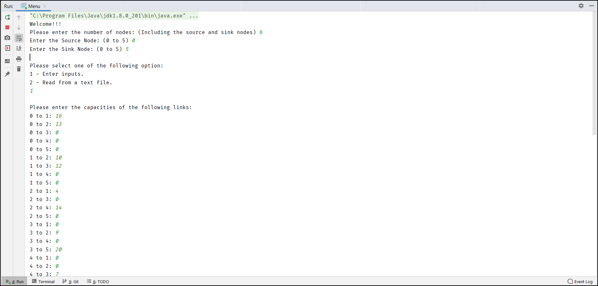
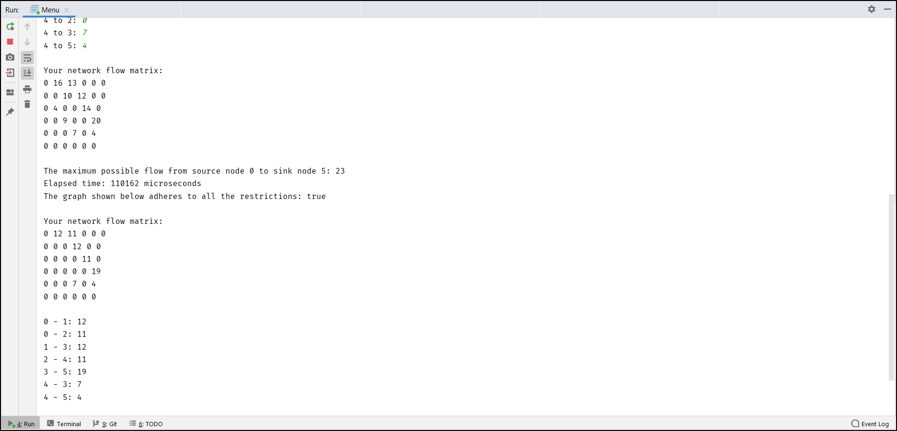
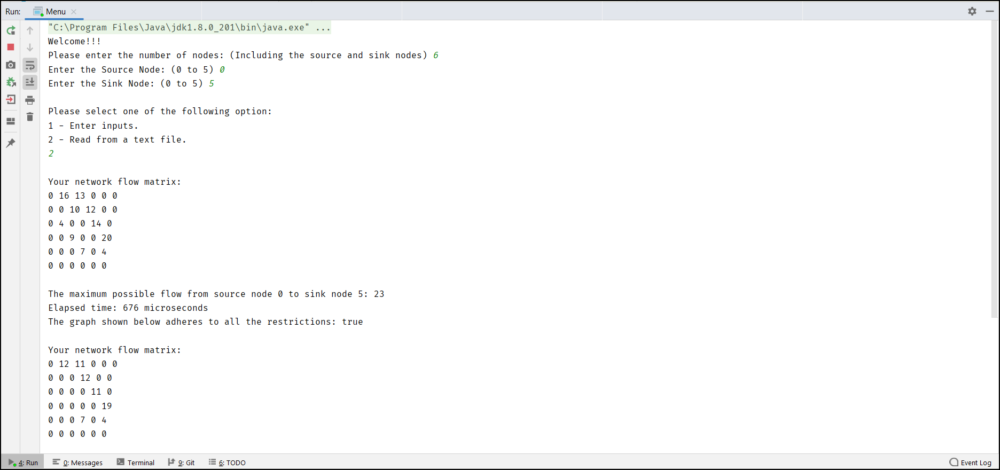
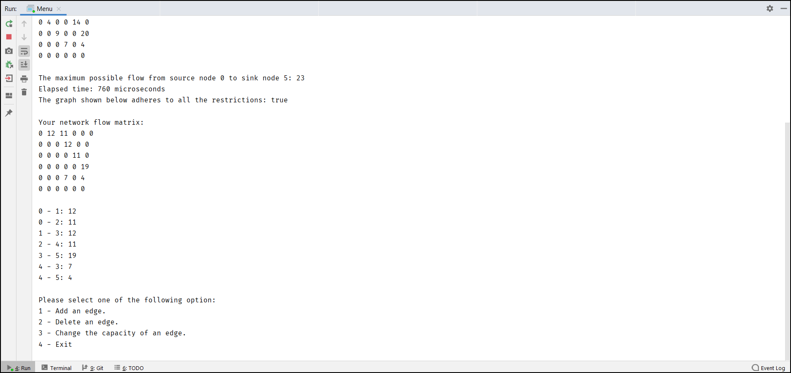

# Maximum Flow Network
A java application that finds the maximum feasible flow that the network would allow to flow from single-source to single-sink. 

## Table of Contents
- [Getting Started](#getting-started)
- [Features](#features)
- [Screenshots](#screenshots)
- [Built With](#built-with)
- [Authors](#authors)
- [License](#license)

## Getting Started

These instructions will get you a copy of the project up and running on your local machine for development and testing purposes.

### Prerequisites

* [JDK 8](https://www.oracle.com/java/technologies/javase/javase-jdk8-downloads.html)

### Installation

#### Clone Repository :
  
    git clone https://github.com/shiromi-basil/max-flow-network.git

#### To run the application from the console :

    cd src/
    javac Menu.java
    java Menu.java

## Features
* Input flow matrix through keyboard.
* Read flow matrix from file (change file name in src/Menu.java).
* Display flow matrix.
* Calculate maximum possible flow from source to sink.
* Display flow of each path.
* Add a new edge to the network.
* Delete a edge from the network.
* Change capacity of an existing edge.
* Recalculate maximum possible flow after any changes.

## Screenshots
#### Input through keyboard :

#### Input through file :

## Built With
* [Java](https://docs.oracle.com/en/java/)

## Authors
* Shiromi Basil - [shiromi-basil](https://github.com/shiromi-basil)

See also the list of [contributors](https://github.com/shiromi-basil/max-flow-network/graphs/contributors) who participated in this project.

## License
This project is licensed under the MIT License - see the [LICENSE](LICENSE) file for details.
